# Agentic Commerce Gateway

> ### Secure, multi-agent procurement for the real world
>
> **Agentic Commerce Gateway** brings bounded AI, deterministic controls, and Razorpay payments together for B2B hardware procurement. Sales agents can search, negotiate, and close deals, while every sensitive decision remains observable, enforceable, and auditable.

[](https://fastapi.tiangolo.com/)
[](https://nextjs.org/)
[](https://www.postgresql.org/)
[](https://razorpay.com/)
[](https://ai.google.dev/)
[](#)

Built for the Razorpay AI Buildathon 2026, with a production-readiness mindset: the model proposes, the platform decides.

## Core Functionalities & Trust Controls

Agentic Commerce Gateway is designed for the point where AI meets money. It treats trust, failure handling, and explainability as first-class product requirements.

| Capability | What it protects and enables |
| --- | --- |
| 🛡️ **Prompt Injection Firewall** | A zero-context LLM barrier classifies every incoming message as `SAFE`, `MALICIOUS`, or `OFF_TOPIC` before it reaches the sales workflow. Jailbreak attempts, instruction overrides, price manipulation, and unrelated requests are blocked at the perimeter. |
| 🧮 **Deterministic Risk Engine** | Checkout is evaluated for fraud vectors before a Razorpay link is generated. Disposable email domains and anomalous ticket sizes increase the risk score; transactions above the threshold are blocked and recorded. |
| 🤝 **Multi-Agent Deal Room** | A frontline Sales Agent handles inventory discovery and negotiation. High-value exceptions can be routed to an isolated Manager Agent, which applies explicit deal-size and discount limits before approving an override. |
| 📚 **Immutable Audit Ledger** | Security blocks, negotiation attempts, manager decisions, and payment-link creation are persisted to PostgreSQL as structured audit events for review and accountability. |
| 🔁 **Resilient AI Router** | Rate-limiting is handled through ordered Gemini model fallbacks. The gateway can move to the next available model instead of allowing a single provider response to interrupt the procurement journey. |
| 🔒 **Concurrency-Safe Inventory** | PostgreSQL row-level locking protects scarce stock when multiple agents attempt to purchase the same product at the same time. |

## Architecture

```mermaid
flowchart LR
    U["👤 Buyer / Procurement User"] --> API["FastAPI<br/>Chat API"]
    API --> FW{"Prompt Injection<br/>Firewall"}
    FW -->|MALICIOUS| BLOCK["🛡️ Block + Audit Ledger"]
    FW -->|OFF_TOPIC| REFUSE["Bounded Response"]
    FW -->|SAFE| ROUTER["Resilient Gemini<br/>Fallback Router"]

    ROUTER --> SALES["🤝 Sales Agent"]
    SALES --> SEARCH["Inventory Search Tool"]
    SEARCH --> EMBED["Gemini Embeddings"]
    EMBED --> VECTOR[("PostgreSQL + pgvector")]
    VECTOR --> SEARCH
    SEARCH --> SALES

    SALES --> NEG["Deterministic<br/>Negotiation Rules"]
    NEG -->|Standard discount| CHECKOUT["Checkout Tool"]
    NEG -->|High-value exception| MANAGER["👔 Isolated Manager Agent"]
    MANAGER -->|Approved override| CHECKOUT
    MANAGER -->|Rejected| AUDIT["Audit Ledger"]

    CHECKOUT --> RISK{"Deterministic<br/>Risk Engine"}
    RISK -->|Blocked: fraud flags| AUDIT
    RISK -->|Approved| RZP["Razorpay SDK<br/>Payment Link"]
    RZP --> AUDIT
    RZP --> RESEND["Resend Async<br/>Secure Invoice"]
    RESEND --> CUSTOMER["📧 Customer Inbox"]

    BLOCK --> AUDIT
    AUDIT[("PostgreSQL<br/>Immutable Audit Events")]

    classDef control fill:#fff4e5,stroke:#d97706,color:#7c2d12
    classDef data fill:#e8f5e9,stroke:#2e7d32,color:#1b5e20
    classDef payment fill:#e8eaf6,stroke:#3949ab,color:#1a237e
    class FW,NEG,RISK,MANAGER control
    class VECTOR,AUDIT data
    class RZP,RESEND payment
```



### Control Principles

- **AI is advisory, not authoritative.** Prices, discounts, stock changes, and checkout eligibility are controlled by deterministic application logic.
- **External payment calls happen last.** The risk engine and audit event are completed before the Razorpay payment link is created.
- **Every exceptional path is visible.** Blocks, overrides, negotiations, and payment actions produce structured records for operators and reviewers.
- **Graceful degradation is deliberate.** Gemini fallback routing, database pool pre-ping, and explicit failure responses keep partial outages contained.

## Tech Stack & Tooling

### Backend

- **Python 3.11+** with **FastAPI** for the HTTP API
- **FastMCP** for agent-facing commerce tools
- **SQLAlchemy async** with `asyncpg` for persistence and connection pooling
- **Pydantic Settings** and `python-dotenv` for environment configuration
- **uv** for reproducible Python dependency and command execution

### Data & Search

- **PostgreSQL 16** as the transactional system of record
- **pgvector** for semantic inventory retrieval
- Row-level locking with `SELECT ... FOR UPDATE` for concurrency-safe stock handling
- Structured audit records for security, negotiation, and payment decisions

### AI, Payments & Notifications

- **Google Gemini** for firewall classification, sales orchestration, and embeddings
- **Razorpay Python SDK** for payment-link generation
- **Resend SDK** for asynchronous secure invoice delivery

### Frontend & Delivery

- **Next.js** with React and TypeScript
- **Tailwind CSS**, Framer Motion, and Lucide icons
- **Docker Compose** for local PostgreSQL infrastructure
- **GitHub Actions** for CI and Render deployment hooks

## Quick Start

### Prerequisites

- Python 3.11 or newer
- [uv](https://docs.astral.sh/uv/)
- [Docker Desktop](https://www.docker.com/products/docker-desktop/)
- Node.js 20 or newer and npm
- Gemini, Razorpay, and Resend credentials for live integrations

### 1. Configure environment variables

```powershell
copy .env.example .env
```

Fill in the values in `.env`, including `DATABASE_URL`, `GEMINI_API_KEY`, `RAZORPAY_KEY_ID`, `RAZORPAY_KEY_SECRET`, and `RESEND_API_KEY`.

### 2. Start PostgreSQL with pgvector

```powershell
docker compose up -d
```

### 3. Initialize the database and sample catalog

```powershell
uv run python -m scripts.seed_db
uv run python -m scripts.seed_mock_data
```

Optional vector backfill:

```powershell
uv run python -m scripts.seed_vectors
```

### 4. Start the FastAPI gateway

```powershell
uv run uvicorn src.api:app --reload --port 8000
```

The API is available at `http://localhost:8000`. Interactive OpenAPI documentation is available at `http://localhost:8000/docs`.

### 5. Start the Next.js operator interface

In a second terminal:

```powershell
cd frontend
npm install
npm run dev
```

The frontend is available at `http://localhost:3000`.

### 6. Run the concurrency test

```powershell
uv run python -m pytest tests/test_concurrency.py -v -s
```

## Project Layout

```text
.
├── .github/workflows/ci-cd.yml   # CI checks and deployment hook
├── frontend/                      # Next.js procurement interface
├── scripts/                       # Schema, catalog, and vector seeding
├── src/
│   ├── api.py                     # FastAPI router and agent orchestration
│   ├── database.py                # Async PostgreSQL engine and sessions
│   ├── engine/                    # Deterministic pricing rules
│   ├── models/                    # SQLAlchemy domain models
│   ├── notifications/             # Resend invoice dispatch
│   └── payments/                  # Razorpay integration
├── tests/                         # Concurrency and behavior checks
├── docker-compose.yml             # Local PostgreSQL + pgvector
├── pyproject.toml                 # Python project metadata
└── requirements.txt                # Deployment-friendly dependencies
```

## Security & Production Notes

- Use Razorpay test credentials during local development and keep all secrets in `.env` or the deployment secret manager.
- Do not expose PostgreSQL publicly; the included Docker configuration is intended for local development.
- Review audit events and risk thresholds before enabling live payment flows.
- The CI workflow can trigger a Render deployment through `RENDER_DEPLOY_HOOK_URL` on pushes to `main`.

## License

Private buildathon project. All rights reserved.